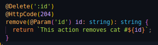

# Documentacion del metodo "delete".

youtube: https://youtu.be/lcKJo0yJvwg

En este deber, empezamos a utilizar los primeros metodos(decoradores) en NestJs. Primero creamos nuestro controlador 'cats' y dentro de este creamos nuestro dtop para crear nuestra clase(entidad).

Una vez creada nuestra entidad podemos empezar importandola en nuestro archivo "cats.controller.ts" donde empezaremos a crear la logica de nuestros ***controladores*** para backend.

El trabajo autonomo en este caso consistia especificamente en crear un metodo para eliminar los datos de un 'id'. Hice uso del metodo de "@Delete" y luego le asigne el codigo **204** que es el que se usa cuando queremos saber si los datos fueron eliminados, pero este no retorna nada.
